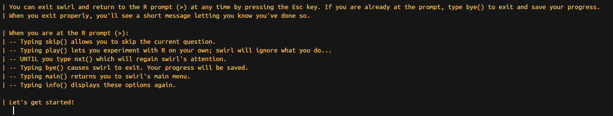
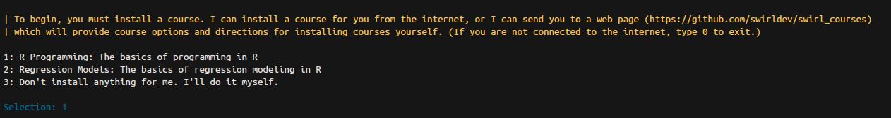

# Curso de R Programming en Swirl 

Swirl es una de las librerías en CRAN que utiliza la consola de R para enseñar
el lenguaje dentro de éste. Es una gran idea y tiene muy buen material, lo único
malo es que solo está disponible en inglés.

Casi todo el material de este lecture está contenido en el curso de **R Programming**.

Para instalar swirl visita [esta página](http://swirlstats.com/students.html) y
sigue las instrucciones. 

Básicamente, debes instalar swirl,

```{r, eval=F}
install.packages("swirl")
library("swirl")
```

Luego llama a la función swirl para activarlo

```{r, eval=F}
swirl()
```

Lo primero que te pedirá es tu nombre de usuario (para que pueda guardar tu avance
en los cursos y no debas regresar) y te dará algunas instrucciones y comandos
útiles.



- `skip()` para saltarte la pregunta actual
- `play()` para poder utilizar la consola en ese momento y practicar un poco más
- `nxt()` para que se pase a la siguiente pregunta
- `bye()` para salir de swirl
- `main()` para regresar al menú principal
- `info()` para recordar las instrucciones

Una vez que te da la introducción, acepta que te instale el curso de **R Programming**




